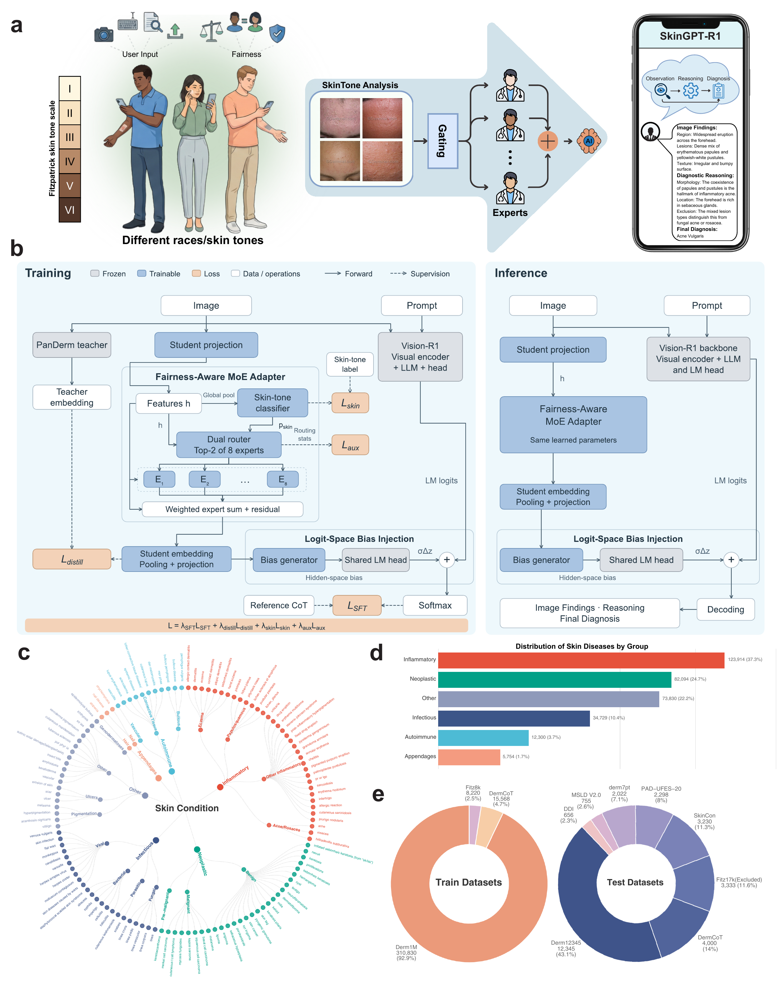

# SkinGPT-R1

**A Multimodal Large Reasoning Model For Fair and Interpretable Dermatological Diagnosis Across Skin Tones**


SkinGPT-R1 is a dermatological vision-language reasoning model from The Chinese University of Hong Kong, Shenzhen. This repository provides model resources, training and inference implementations, evaluation prompts and settings, and accompanying table data.

[Paper](https://arxiv.org/abs/2511.15242) | [Training implementation](train/README.md) | [GitHub code](https://github.com/yuhos16/SkinGPT-R1) | [Prompts and evaluation settings](docs/evaluation_prompts_and_settings.md) | [Inference guide](inference/README.md) | [Table source data](source_data/README.md)

## Repository contents

| Path | Contents |
| --- | --- |
| [Hugging Face checkpoint](https://huggingface.co/yuhos16/SkinGPT-R1/tree/main/checkpoint) | Released model weights, configuration, tokenizer, and processor |
| `prompts/` | Diagnostic and judge prompts, plus the 160-case candidate vocabulary |
| `configs/` | Diagnostic generation settings and DDI judge configuration |
| `inference/evaluation/` | Single-image and batched inference example using the documented prompts |
| `inference/full_precision/` | Interactive inference and API examples |
| `inference/int4_quantized/` | Custom model implementation and INT4 inference interfaces |
| `evaluation/` | Judge request construction, response validation, and aggregate calculations |
| `source_data/` | Source Data workbook matching the revision tables |
| `docs/` | Evaluation protocol and runtime documentation |
| `train/` | SFT implementation, MoE and skin-label modules, configuration, launcher, and model asset manifest |
| `tests/` | Prompt, scoring, and local checkpoint validation checks |

## Get the code and install

Clone the code:

```bash
git clone https://github.com/yuhos16/SkinGPT-R1.git
cd SkinGPT-R1
conda env create -f environment.yml
conda activate skingpt-r1
python -m pip install flash-attn --no-build-isolation
```

Actual inference requires the released weight tensors in `checkpoint/`. To retrieve only those objects when preparing a GPU run:

```bash
hf download yuhos16/SkinGPT-R1 --include 'checkpoint/*' --local-dir .
```

Alternatively, use an existing local checkpoint and pass its directory through `--model-path`. See the [Hugging Face download guide](https://huggingface.co/docs/hub/en/models-downloading) for download options. The example uses CUDA, bfloat16, and FlashAttention-2. SDPA can be selected explicitly for a compatible runtime.

## Training source and model version

The [training directory](train/README.md) contains the custom adapter, four-term training objective, data loader and collator, dataset registration, and SFT launcher. The model weights are hosted at [Hugging Face](https://huggingface.co/yuhos16/SkinGPT-R1). The [asset manifest](train/manifests/released_model.json) identifies the released checkpoint by an immutable repository revision and weight-shard hashes. GitHub distributes the code and accompanying resources, with weights linked to this Hugging Face project.

## Run the supplied diagnostic prompt

```bash
CUDA_VISIBLE_DEVICES=0 python -m inference.evaluation.run_inference --model-path ./checkpoint --image /path/to/lesion.jpg --mode ddi --output outputs/lesion.json
```

This command creates a distinct system message with the image-grounded dermatology instruction and a user message containing the image and diagnostic request. Use `--dry-run` to inspect the messages without loading weights. The [inference guide](inference/README.md) covers candidate-label classification, the vocabulary bias mask, batching, and runtime overrides.

## Evaluation and source data

The [evaluation specification](docs/evaluation_prompts_and_settings.md) gives the diagnostic prompts, DDI judge prompts, generation settings, and scoring rules. The 160-case classification comparison reports **PanDerm 90/160, 56.25%** and **SkinGPT-R1 81/160, 50.63%**. The gap is **9 cases, 5.63 percentage points**. These values describe the reported classification setting. The clinician preference analysis uses 158 completed cases and separate outcomes.

The [Source Data workbook](source_data/Source_Data.xlsx) contains the table values and configurations in 54 worksheets plus an index. Raw case-level CSV files and individual clinician assessments are excluded from this release.

Check aggregate arithmetic and the lightweight interfaces:

```bash
python evaluation/check_reported_results.py
python -m unittest discover -s tests -v
```

These checks validate prompt construction, request schemas, local checkpoint safeguards, and aggregate calculations. A model inference run additionally requires the GPU environment and actual weight tensors.



[Figure 1, full-resolution PDF](figures/fig1.pdf)

## Intended use

SkinGPT-R1 is for research and educational use. Its outputs require clinical review and should not be used as standalone medical advice, diagnosis, or treatment.

## License

Project-specific code is released under the [MIT License](LICENSE). The included LLaMA-Factory source retains its [Apache-2.0 notices](train/licenses/README.md). Source datasets retain their respective access conditions and licenses.
